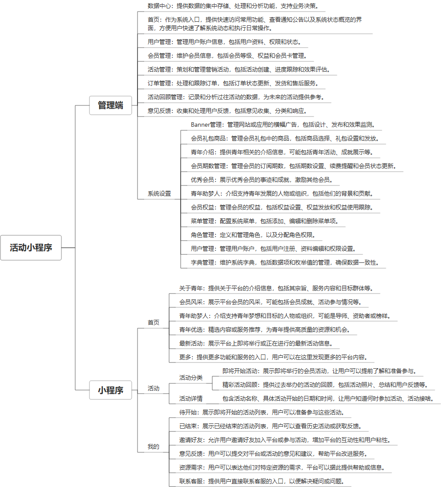

 

    
 

公司拥有上百套具有自主知识产权的软件系统，详情请查看码云首页或公司官网

 
<h1>活动组织管理小程序</h1>

<a href="https://www.haishi.net.cn/">公司官网</a> ｜ <a href="https://www.haishi.net.cn/">在线体验</a>

 

## 系统介绍

包含用户管理、活动管理、活动订单管理、活动回顾管理等功能
包含用户管理、活动管理、活动订单管理、活动回顾管理等功能
本项目名称为活动组织管理系统，是一个用于管理活动组织、会员信息、活动流程、订单以及用户反馈的综合性系统。该系统旨在提高活动组织效率，优化会员管理，方便用户参与活动并提供反馈。
本项目包含管理后台和小程序端两个主要终端：
- 管理后台：供管理员用户使用，可以进行系统设置、用户管理、会员管理、活动管理、订单管理、活动回顾管理、意见反馈处理等操作。
- 小程序端：供普通用户使用，主要功能包括查看首页、浏览活动、查看消息、管理个人信息等。
                

## 系统功能介绍

### 系统包含终端说明

管理端（WEB）、用户端（微信小程序）

| 序号 | 模块 | 模块说明 |
| --- | --- | --- |
| 1 | FWY-HDGL-BBQN-MP | 小程序 |
| 2 | FWY-HDGL-BBQN-SERVER | 服务端 |
| 3 | FWY-HDGL-BBQN-MANAGE | 管理端 |

### 系统功能结构

### 系统功能说明

主要功能：
- 用户管理：管理用户信息，包括角色权限设置。
- 会员管理：管理会员信息，包括会员等级、权益、礼包等。
- 活动管理：创建、编辑、发布活动，管理活动流程。
- 订单管理：管理活动相关的订单信息。
- 活动回顾管理：管理活动回顾内容，例如精彩活动回顾。
- 意见反馈：收集用户反馈，改进系统和服务。
- 小程序端活动浏览：用户可以通过小程序端浏览活动信息，包括即将开始的活动和精彩活动回顾。
- 小程序端消息通知：用户可以通过小程序端接收消息通知。
- 首页Banner管理：管理首页Banner图片，用于展示重要信息或推广活动。

## 系统主要界面

## 系统技术说明

### 代码模块说明

| 序号 | 目录 | 目录说明 |
| --- | --- | --- |
| 1 | FWY-HDGL-BBQN-SERVER/src | -- |

### 系统技术选型

#### 开发语言/框架

JAVA（JDK1.8）
前端框架：VUE2

#### 服务中间件

Nginx
Tomcat

#### 数据库

MySQL（5.7+）

#### 其他说明

无

## 系统演示/商用

请扫码添加客服微信获取演示地址和系统详细资料。

如果您想基于活动组织管理小程序进行商业化交付或定制开发服务，我们提供有偿的技术服务支持，合作模式不限，欢迎沟通！

公司官网地址： <a href="https://www.haishi.net.cn/">https://www.haishi.net.cn</a>

联系客服获取专业回答。

## 使用须知

1、 本项目商用必须获得版权所有者的授权。

2、 未经允许本项目代码不允许二次出售。

